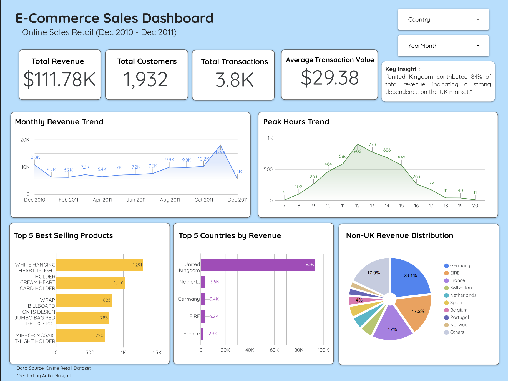

# E-Commerce Sales Dashboard

## Project Overview
This project analyzes an Online Retail dataset and visualizes key business insights using Google Looker Studio.

## Objectives
- Analyze sales performance
- Identify monthly revenue trends
- Find best-selling products
- Analyze transaction peak hours
- Understand country-level revenue contribution

## Tools Used
- Python
- Pandas
- Matplotlib
- Google Sheets
- Google Looker Studio

## Key Insights
- Total revenue reached $111.8K.
- November 2011 recorded the highest monthly revenue.
- Peak transaction activity occurred at 12 PM.
- The best-selling product was White Hanging Heart T-Light Holder.
- The United Kingdom contributed approximately 84% of total revenue.

## Dashboard Preview

## Dashboard Link
[View Dashboard Here](https://datastudio.google.com/reporting/7c7cf6fd-9959-4c3a-a75e-cca45ca482c7)
